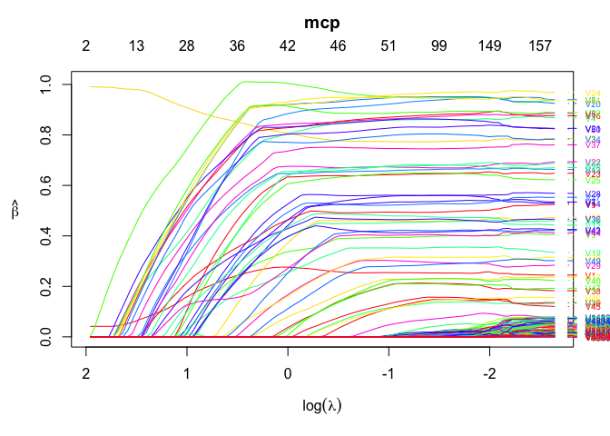

## Introduction to \`ordinis’

The ‘ordinis’ package provides computation for penalized regression
problems via coordinate descent. It is mostly for my own experimentation
at this stage, however it is fairly efficient and reliable.

Install using the **devtools** package:

``` r
devtools::install_github("jaredhuling/ordinis")
```

or by cloning and building

## Example

``` r
library(ordinis)

# compute the full solution path, n > p
set.seed(123)
n <- 500
p <- 50000
m <- 50
b <- matrix(c(runif(m), rep(0, p - m)))
x <- matrix(rnorm(n * p, sd = 3), n, p)
y <- drop(x %*% b) + rnorm(n)

mod <- ordinis(x, y, 
               penalty = "mcp",
               lower.limits = rep(0, p), # force all coefficients to be positive
               penalty.factor = c(0, 0, rep(1, p-2)), # don't penalize first two coefficients
               alpha = 0.5)  # use elastic net with alpha = 0.5

plot(mod)
```

<!-- -->

``` r
## show likelihood
logLik(mod)
```

    ## 'log Lik.' -1960.49813, -1959.11602, -1957.22728, -1955.46997, -1953.83905, -1951.18778, -1944.83432, -1934.96908, -1923.61162, -1911.68800, -1899.38945, -1886.94068, -1870.70306, -1853.71527, -1835.88771, -1818.12089, -1800.62272, -1782.91165, -1765.02371, -1744.03173, -1722.06008, -1697.80162, -1672.14740, -1643.37205, -1613.50849, -1583.57184, -1553.68019, -1523.01592, -1491.42201, -1459.75995, -1427.46971, -1394.69243, -1361.31113, -1328.75391, -1298.28699, -1267.58392, -1237.50469, -1208.89418, -1181.43450, -1155.70057, -1129.56217, -1103.84077, -1079.11800, -1053.56659, -1027.81139, -1003.49526,  -981.29302,  -958.05930,  -935.68882,  -914.96688,  -894.14723,  -873.35402,  -854.49331,  -837.64559,  -822.32905,  -808.56585,  -795.50199,  -783.05927,  -772.17178,  -762.55231,  -754.06746,  -746.66521,  -739.98148,  -733.34922,  -725.89430,  -719.55428,  -713.05911,  -705.65731,  -697.22796,  -687.40700,  -676.01272,  -662.39356,  -648.29655,  -634.45234,  -618.92664,  -602.75214,  -585.23559,  -566.85432,  -548.59189,  -529.39396,  -509.79779,  -488.88167,  -465.97532,  -443.45520,  -419.01868,  -393.86363,  -366.04390,  -340.58367,  -311.12623,  -287.50826,  -259.68528,  -236.96888,  -215.41972,  -192.42991,  -169.13255,  -147.63506,  -124.86326,   -99.06300,   -75.23508,   -50.87992 (df=  3  4  4  4  4  6  9 12 13 14 14 16 19 20 22 22 23 23 24 27 28 30 31 34 34 34 34 35 35 36 37 37 38 38 38 40 40 40 40 41 42 42 43 43 44 44 45 46 46 46 47 47 47 47 47 47 48 48 48 48 48 48 49 52 52 52 55 58 63 68 75 86 88 95 99107115122127136139148148151150150151154147154151147154155152159163161164169)

``` r
## compute AIC
AIC(mod)
```

    ##   [1] 3926.9963 3926.2320 3922.4546 3918.9399 3915.6781 3914.3756 3907.6686
    ##   [8] 3893.9382 3873.2232 3851.3760 3826.7789 3805.8814 3779.4061 3747.4305
    ##  [15] 3715.7754 3680.2418 3647.2454 3611.8233 3578.0474 3542.0635 3500.1202
    ##  [22] 3455.6032 3406.2948 3354.7441 3295.0170 3235.1437 3175.3604 3116.0318
    ##  [29] 3052.8440 2991.5199 2928.9394 2863.3849 2798.6223 2733.5078 2672.5740
    ##  [36] 2615.1678 2555.0094 2497.7884 2442.8690 2393.4011 2343.1243 2291.6815
    ##  [43] 2244.2360 2193.1332 2143.6228 2094.9905 2052.5860 2008.1186 1963.3776
    ##  [50] 1921.9338 1882.2945 1840.7080 1802.9866 1769.2912 1738.6581 1711.1317
    ##  [57] 1687.0040 1662.1185 1640.3436 1621.1046 1604.1349 1589.3304 1577.9630
    ##  [64] 1570.6984 1555.7886 1543.1086 1536.1182 1527.3146 1520.4559 1510.8140
    ##  [71] 1502.0254 1496.7871 1472.5931 1458.9047 1435.8533 1419.5043 1400.4712
    ##  [78] 1377.7086 1351.1838 1330.7879 1297.5956 1273.7633 1227.9506 1188.9104
    ##  [85] 1138.0374 1087.7273 1034.0878  989.1673  916.2525  883.0165  821.3706
    ##  [92]  767.9378  738.8394  694.8598  642.2651  613.2701  575.7265  520.1260
    ##  [99]  478.4702  439.7598

``` r
## BIC
BIC(mod)
```

    ##   [1] 3939.640 3943.090 3939.313 3935.798 3932.537 3939.663 3945.600
    ##   [8] 3944.513 3928.013 3910.381 3885.783 3873.315 3859.484 3831.723
    ##  [15] 3808.497 3772.963 3744.181 3708.759 3679.198 3655.858 3618.129
    ##  [22] 3582.041 3536.948 3498.041 3438.314 3378.440 3318.657 3263.543
    ##  [29] 3200.355 3143.246 3084.880 3019.325 2958.777 2893.663 2832.729
    ##  [36] 2783.752 2723.594 2666.373 2611.453 2566.200 2520.138 2468.695
    ##  [43] 2425.464 2374.361 2329.066 2280.433 2242.243 2201.991 2157.250
    ##  [50] 2115.806 2080.381 2038.795 2001.073 1967.378 1936.745 1909.218
    ##  [57] 1889.305 1864.420 1842.645 1823.406 1806.436 1791.632 1784.479
    ##  [64] 1789.858 1774.948 1762.268 1767.922 1771.762 1785.976 1797.407
    ##  [71] 1818.121 1859.243 1843.479 1859.292 1853.099 1870.467 1885.151
    ##  [78] 1891.891 1886.439 1903.975 1883.426 1897.525 1851.713 1825.316
    ##  [85] 1770.229 1719.918 1670.494 1638.217 1535.800 1532.066 1457.776
    ##  [92] 1387.485 1387.889 1348.124 1282.886 1283.393 1262.708 1198.678
    ##  [99] 1169.666 1152.029

## Performance

### Lasso (linear regression)

``` r
library(microbenchmark)
library(glmnet)

b <- matrix(c(runif(m, min = -1), rep(0, p - m)))
x <- matrix(rnorm(n * p, sd = 3), n, p)
y <- drop(x %*% b) + rnorm(n)

lambdas = glmnet(x, y)$lambda

microbenchmark(
    "glmnet[lasso]" = {resg <- glmnet(x, y, thresh = 1e-10,  # thresh must be very small 
                                      lambda = lambdas)},    # for comparable precision
    "ordinis[lasso]" = {reso <- ordinis(x, y, lambda = lambdas, 
                                       tol = 1e-3)},
    times = 5
)
```

    ## Unit: seconds
    ##            expr      min       lq     mean   median       uq      max
    ##   glmnet[lasso] 4.188987 4.224132 4.288886 4.297551 4.301313 4.432446
    ##  ordinis[lasso] 6.776044 6.806070 7.036123 7.011830 7.271921 7.314747
    ##  neval
    ##      5
    ##      5

``` r
# difference of results
max(abs(coef(resg) - reso$beta))
```

    ## [1] 0.000839476

``` r
microbenchmark(
    "glmnet[lasso]" = {resg <- glmnet(x, y, thresh = 1e-15,  # thresh must be very low for comparable precision
                                      lambda = lambdas)},
    "ordinis[lasso]" = {reso <- ordinis(x, y, lambda = lambdas, 
                                            tol = 1e-3)},
    times = 5
)
```

    ## Unit: seconds
    ##            expr      min       lq     mean   median       uq      max
    ##   glmnet[lasso] 7.043160 7.134532 7.622043 7.248525 8.305858 8.378141
    ##  ordinis[lasso] 6.682635 6.730448 7.529354 7.108582 7.738437 9.386667
    ##  neval
    ##      5
    ##      5

``` r
# difference of results
max(abs(coef(resg) - reso$beta))
```

    ## [1] 5.076034e-05

### Lasso (logistic regression)

`glmnet` is clearly faster for logistic regression for the same
precision

``` r
library(MASS)

set.seed(123)
n <- 100
p <- 10000
m <- 20
b <- matrix(c(runif(m), rep(0, p - m)))
x <- matrix(rnorm(n * p, sd = 3), n, p)
y <- 1 *(drop(x %*% b) + rnorm(n) > 0)

lambdas = glmnet(x, y, family = "binomial")$lambda

microbenchmark(
    "glmnet[lasso]" = {resg <- glmnet(x, y, family = "binomial",
                                      thresh = 1e-10,  
                                      lambda = lambdas)},    
    "ordinis[lasso]"     = {reso <- ordinis(x, y, family = "binomial", 
                                            lambda = lambdas, 
                                            tol = 1e-4, tol.irls = 1e-3)},
    times = 5
)
```

    ## Unit: milliseconds
    ##            expr       min        lq      mean    median        uq
    ##   glmnet[lasso]  219.1414  274.5992  352.6697  309.3719  392.6667
    ##  ordinis[lasso] 1554.2739 1658.0530 1782.3042 1740.1213 1861.8684
    ##        max neval
    ##   567.5693     5
    ##  2097.2041     5

``` r
# difference of results
max(abs(coef(resg) - reso$beta))
```

    ## [1] 0.001109771

``` r
microbenchmark(
    "glmnet[lasso]" = {resg <- glmnet(x, y, family = "binomial",
                                      thresh = 1e-15,  
                                      lambda = lambdas)},    
    "ordinis[lasso]"     = {reso <- ordinis(x, y, family = "binomial", 
                                            lambda = lambdas, 
                                            tol = 1e-4, tol.irls = 1e-3)},
    times = 5
)
```

    ## Unit: milliseconds
    ##            expr       min        lq      mean    median        uq
    ##   glmnet[lasso]  603.9843  682.5605  750.7674  801.9547  826.6033
    ##  ordinis[lasso] 1448.1314 1451.7268 1705.1744 1783.5367 1803.8483
    ##        max neval
    ##   838.7343     5
    ##  2038.6288     5

``` r
# difference of results
max(abs(coef(resg) - reso$beta))
```

    ## [1] 1.280118e-05

### Lasso (linear regression, ill-conditioned)

``` r
library(MASS)

set.seed(123)
n <- 500
p <- 1000
m <- 50
b <- matrix(c(runif(m, min = -1), rep(0, p - m)))
sig <- matrix(0.5, ncol=p,nrow=p); diag(sig) <- 1
x <- mvrnorm(n, mu=rep(0, p), Sigma = sig)
y <- drop(x %*% b) + rnorm(n)

lambdas = glmnet(x, y)$lambda[1:65]

microbenchmark(
    "glmnet[lasso]" = {resg <- glmnet(x, y, thresh = 1e-9,  # thresh must be very small 
                                      lambda = lambdas)},    # for comparable precision
    "ordinis[lasso]" = {reso <- ordinis(x, y, lambda = lambdas, 
                                       tol = 1e-5)},
    times = 5
)
```

    ## Unit: milliseconds
    ##            expr      min       lq     mean   median       uq      max
    ##   glmnet[lasso] 188.9722 218.3615 236.9786 234.9423 241.3282 301.2888
    ##  ordinis[lasso] 371.1704 394.5426 426.2207 410.3221 436.8171 518.2515
    ##  neval
    ##      5
    ##      5

``` r
# difference of results
max(abs(coef(resg) - reso$beta))
```

    ## [1] 0.0002629008

``` r
microbenchmark(
    "glmnet[lasso]" = {resg <- glmnet(x, y, thresh = 1e-11,  # thresh must be very low for comparable precision
                                      lambda = lambdas)},
    "ordinis[lasso]" = {reso <- ordinis(x, y, lambda = lambdas, 
                                            tol = 1e-5)},
    times = 5
)
```

    ## Unit: milliseconds
    ##            expr      min       lq     mean   median       uq      max
    ##   glmnet[lasso] 411.2623 416.0729 440.1107 435.6880 464.2040 473.3264
    ##  ordinis[lasso] 329.0319 365.4790 388.0342 365.6153 374.1673 505.8777
    ##  neval
    ##      5
    ##      5

``` r
# difference of results
max(abs(coef(resg) - reso$beta))
```

    ## [1] 2.454331e-05
