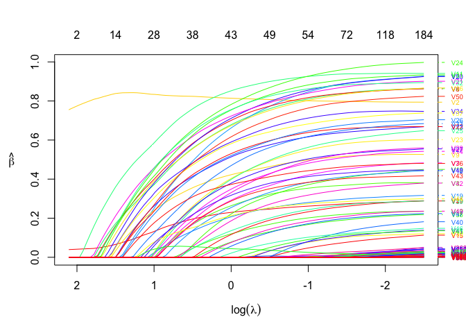

## Introduction to \`ordinis’

Install using the **devtools** package:

``` r
devtools::install_github("jaredhuling/ordinis")
```

or by cloning and building

## Example

``` r
library(ordinis)

# compute the full solution path, n > p
set.seed(123)
n <- 500
p <- 1000
m <- 50
b <- matrix(c(runif(m), rep(0, p - m)))
x <- matrix(rnorm(n * p, sd = 3), n, p)
y <- drop(x %*% b) + rnorm(n)

mod <- lasso(x, y, 
             lower.limits = rep(0, p), # force all coefficients to be positive
             penalty.factor = c(0, 0, rep(1, p-2)), # don't penalize first two coefficients
             alpha = 0.5)  # use elastic net with alpha = 0.5

plot(mod)
```

<!-- -->

``` r
## show likelihood
logLik(mod)
```

    ## 'log Lik.' -1967.9034, -1967.8390, -1967.7784, -1967.7214, -1966.5746, -1965.1523, -1963.8118, -1962.1295, -1958.6048, -1952.7794, -1945.5702, -1937.8176, -1929.0723, -1919.3565, -1908.0447, -1896.0503, -1882.7936, -1869.8325, -1857.0629, -1844.0264, -1830.9850, -1817.8073, -1804.3347, -1790.6844, -1775.0466, -1758.0818, -1740.3144, -1722.4073, -1704.2390, -1686.2271, -1668.2931, -1650.2084, -1631.1595, -1611.9925, -1592.9571, -1573.9052, -1554.4479, -1534.9206, -1515.2424, -1495.6981, -1475.8786, -1456.1834, -1436.6394, -1417.0046, -1397.5341, -1378.2492, -1359.1677, -1340.3080, -1321.4011, -1302.6709, -1284.1932, -1265.5977, -1246.6656, -1227.9899, -1209.5899, -1191.4854, -1173.3787, -1154.3137, -1135.5076, -1116.9685, -1098.6600, -1080.6663, -1063.0072, -1045.7025, -1028.7561, -1012.1958,  -995.9891,  -980.1022,  -964.5769,  -949.4113,  -934.5822,  -919.9863,  -905.8100,  -892.0832,  -878.5893,  -865.2175,  -852.2313,  -839.6349,  -826.8473,  -814.2741,  -801.6480,  -789.1448,  -776.7647,  -764.6952,  -752.7599,  -740.8598,  -729.0839,  -717.2206,  -705.5147,  -694.0812,  -682.5223,  -671.0281,  -659.8626,  -648.6518,  -637.4842,  -626.6976,  -615.9255,  -605.0067,  -593.8071,  -582.6243 (df=  3  3  3  3  4  4  4  6  8 10 11 12 15 15 18 21 21 21 22 23 24 25 26 29 31 34 34 35 35 35 36 38 39 39 39 40 41 42 42 42 43 43 43 44 44 44 44 44 45 46 46 48 48 48 48 48 50 51 51 52 52 52 52 52 53 53 55 55 57 58 61 62 62 63 68 70 72 73 77 80 84 89 91 94 98102109115119120129133141147149152160163173185)

``` r
## compute AIC
AIC(mod)
```

    ##   [1] 3941.807 3941.678 3941.557 3941.443 3941.149 3938.305 3935.624
    ##   [8] 3936.259 3933.210 3925.559 3913.140 3899.635 3888.145 3868.713
    ##  [15] 3852.089 3834.101 3807.587 3781.665 3758.126 3734.053 3709.970
    ##  [22] 3685.615 3660.669 3639.369 3612.093 3584.164 3548.629 3514.815
    ##  [29] 3478.478 3442.454 3408.586 3376.417 3340.319 3301.985 3263.914
    ##  [36] 3227.810 3190.896 3153.841 3114.485 3075.396 3037.757 2998.367
    ##  [43] 2959.279 2922.009 2883.068 2844.498 2806.335 2768.616 2732.802
    ##  [50] 2697.342 2660.386 2627.195 2589.331 2551.980 2515.180 2478.971
    ##  [57] 2446.757 2410.627 2373.015 2337.937 2301.320 2265.333 2230.014
    ##  [64] 2195.405 2163.512 2130.392 2101.978 2070.204 2043.154 2014.823
    ##  [71] 1991.164 1963.973 1935.620 1910.166 1893.179 1870.435 1848.463
    ##  [78] 1825.270 1807.695 1788.548 1771.296 1756.290 1735.529 1717.390
    ##  [85] 1701.520 1685.720 1676.168 1664.441 1649.029 1628.162 1623.045
    ##  [92] 1608.056 1601.725 1591.304 1572.968 1557.395 1551.851 1536.013
    ##  [99] 1533.614 1535.249

``` r
## BIC
BIC(mod)
```

    ##   [1] 3954.451 3954.322 3954.201 3954.087 3958.008 3955.163 3952.482
    ##   [8] 3961.547 3966.927 3967.705 3959.501 3950.211 3951.364 3931.932
    ##  [15] 3927.952 3922.607 3896.094 3870.172 3850.847 3830.989 3811.121
    ##  [22] 3790.980 3770.249 3761.592 3742.746 3727.460 3691.926 3662.326
    ##  [29] 3625.989 3589.965 3560.312 3536.572 3504.689 3466.355 3428.284
    ##  [36] 3396.395 3363.695 3330.855 3291.498 3252.410 3218.985 3179.595
    ##  [43] 3140.507 3107.452 3068.511 3029.941 2991.778 2954.059 2922.460
    ##  [50] 2891.214 2854.258 2829.497 2791.632 2754.281 2717.481 2681.272
    ##  [57] 2657.488 2625.572 2587.960 2557.097 2520.480 2484.492 2449.174
    ##  [64] 2414.565 2386.886 2353.766 2333.782 2302.008 2283.386 2259.270
    ##  [71] 2248.256 2225.278 2196.926 2175.687 2179.772 2165.458 2151.914
    ##  [78] 2132.936 2132.219 2125.717 2125.323 2131.390 2119.059 2113.563
    ##  [85] 2114.551 2115.610 2135.560 2149.121 2150.568 2133.915 2166.729
    ##  [92] 2168.599 2195.985 2210.851 2200.945 2198.016 2226.188 2222.995
    ##  [99] 2262.741 2314.951

## Performance

### Lasso

``` r
library(microbenchmark)
library(glmnet)

b <- matrix(c(runif(m, min = -1), rep(0, p - m)))
x <- matrix(rnorm(n * p, sd = 3), n, p)
y <- drop(x %*% b) + rnorm(n)

lambdas = glmnet(x, y)$lambda

microbenchmark(
    "glmnet[lasso]" = {resg <- glmnet(x, y, thresh = 1e-10,  # thresh must be very low for comparable precision
                                      lambda = lambdas)},
    "cd[lasso]"     = {reso <- lasso(x, y, lambda = lambdas, 
                                        tol = 1e-5)},
    times = 5
)
```

    ## Unit: milliseconds
    ##           expr      min       lq     mean   median       uq      max neval
    ##  glmnet[lasso] 126.5762 130.8960 168.5428 132.1078 132.9792 320.1547     5
    ##      cd[lasso] 118.8446 123.8788 132.3816 125.8726 126.0638 167.2482     5

``` r
# difference of results
max(abs(coef(resg) - reso$beta))
```

    ## [1] 9.651536e-05

``` r
microbenchmark(
    "glmnet[lasso]" = {resg <- glmnet(x, y, thresh = 1e-15,  # thresh must be very low for comparable precision
                                      lambda = lambdas)},
    "cd[lasso]"     = {reso <- lasso(x, y, lambda = lambdas, 
                                        tol = 1e-5)},
    times = 5
)
```

    ## Unit: milliseconds
    ##           expr      min       lq     mean   median       uq      max neval
    ##  glmnet[lasso] 257.9730 263.0274 262.8688 263.8827 264.5919 264.8692     5
    ##      cd[lasso] 118.1103 118.5850 120.8434 120.2653 120.7351 126.5210     5

``` r
# difference of results
max(abs(coef(resg) - reso$beta))
```

    ## [1] 4.859694e-07
