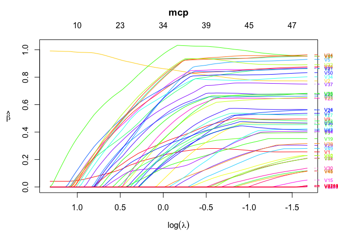

## Introduction to \`ordinis’

The ‘ordinis’ package provides computation for penalized regression
problems via coordinate descent. It is mostly for my own experimentation
at this stage, however it is fairly efficient and reliable.

Install using the **devtools** package:

``` r
devtools::install_github("jaredhuling/ordinis")
```

or by cloning and building

## Example

``` r
library(ordinis)

# compute the full solution path, n > p
set.seed(123)
n <- 500
p <- 50000
m <- 50
b <- matrix(c(runif(m), rep(0, p - m)))
x <- matrix(rnorm(n * p, sd = 3), n, p)
y <- drop(x %*% b) + rnorm(n)

mod <- ordinis(x, y, 
               penalty = "mcp",
               lower.limits = rep(0, p), # force all coefficients to be positive
               penalty.factor = c(0, 0, rep(1, p-2)), # don't penalize first two coefficients
               alpha = 0.5)  # use elastic net with alpha = 0.5

plot(mod)
```

<!-- -->

``` r
## show likelihood
logLik(mod)
```

    ## 'log Lik.' -1960.49813, -1959.21537, -1957.44975, -1955.79297, -1954.24224, -1951.69695, -1945.66685, -1936.22990, -1925.42715, -1914.06240, -1902.28276, -1890.29269, -1874.65881, -1858.36854, -1841.05677, -1823.86748, -1806.83500, -1789.58627, -1772.05014, -1752.12069, -1730.76190, -1707.34550, -1682.58564, -1654.79678, -1625.89981, -1596.84257, -1567.70027, -1538.00139, -1507.06010, -1475.69432, -1443.25779, -1410.65617, -1377.29722, -1344.21268, -1312.09040, -1280.17479, -1248.56127, -1219.20295, -1191.46235, -1164.73336, -1137.92223, -1111.32479, -1086.06446, -1060.25817, -1034.02831, -1009.14279,  -985.98731,  -962.13875,  -939.85540,  -918.75304,  -897.88775,  -876.86362,  -857.47388,  -840.27591,  -824.77322,  -810.76439,  -797.47388,  -784.63629,  -773.58548,  -763.80031,  -755.18575,  -747.64301,  -740.71842,  -733.90971,  -726.33667,  -719.87121,  -713.31688,  -705.86791,  -697.42479,  -687.62933,  -676.14909,  -662.48183,  -648.34987,  -634.58765,  -619.10019,  -602.94638,  -585.42208,  -567.05117,  -548.81607,  -529.62422,  -510.03680,  -489.18403,  -466.35772,  -443.71745,  -419.32470,  -394.28820,  -366.61393,  -341.36124,  -311.60275,  -287.92386,  -260.23745,  -237.32359,  -215.72079,  -193.19098,  -169.53832,  -147.94197,  -125.11492,   -99.36777,   -75.58713,   -51.14777 (df=  3  4  4  4  4  6  9 12 13 14 14 17 19 20 22 22 23 23 24 27 29 31 33 35 35 34 34 35 35 36 37 37 38 38 38 40 40 40 40 41 42 42 43 43 44 44 45 46 46 46 47 47 47 47 47 47 48 48 48 48 48 48 49 52 52 52 55 59 63 69 75 86 88 93100107116122127136139148150150150150151153148154152147153157152158163161165168)

``` r
## compute AIC
AIC(mod)
```

    ##   [1] 3926.9963 3926.4307 3922.8995 3919.5859 3916.4845 3915.3939 3909.3337
    ##   [8] 3896.4598 3876.8543 3856.1248 3832.5655 3814.5854 3787.3176 3756.7371
    ##  [15] 3726.1135 3691.7350 3659.6700 3625.1725 3592.1003 3558.2414 3519.5238
    ##  [22] 3476.6910 3431.1713 3379.5936 3321.7996 3261.6851 3203.4005 3146.0028
    ##  [29] 3084.1202 3023.3886 2960.5156 2895.3123 2830.5944 2764.4254 2700.1808
    ##  [36] 2640.3496 2577.1225 2518.4059 2462.9247 2411.4667 2359.8445 2306.6496
    ##  [43] 2258.1289 2206.5163 2156.0566 2106.2856 2061.9746 2016.2775 1971.7108
    ##  [50] 1929.5061 1889.7755 1847.7272 1808.9478 1774.5518 1743.5464 1715.5288
    ##  [57] 1690.9478 1665.2726 1643.1710 1623.6006 1606.3715 1591.2860 1579.4368
    ##  [64] 1571.8194 1556.6733 1543.7424 1536.6338 1529.7358 1520.8496 1513.2587
    ##  [71] 1502.2982 1496.9637 1472.6997 1455.1753 1438.2004 1419.8928 1402.8442
    ##  [78] 1378.1023 1351.6321 1331.2484 1298.0736 1274.3681 1232.7154 1187.4349
    ##  [85] 1138.6494 1088.5764 1035.2279  988.7225  919.2055  883.8477  824.4749
    ##  [92]  768.6472  737.4416  700.3820  643.0766  611.8839  576.2298  520.7355
    ##  [99]  481.1743  438.2955

``` r
## BIC
BIC(mod)
```

    ##   [1] 3939.640 3943.289 3939.758 3936.444 3933.343 3940.682 3947.265
    ##   [8] 3947.035 3931.644 3915.129 3891.570 3886.234 3867.395 3841.029
    ##  [15] 3818.835 3784.456 3756.606 3722.109 3693.251 3672.036 3641.747
    ##  [22] 3607.344 3570.253 3527.105 3469.311 3404.982 3346.697 3293.514
    ##  [29] 3231.631 3175.115 3116.456 3051.253 2990.750 2924.580 2860.336
    ##  [36] 2808.934 2745.707 2686.990 2631.509 2584.266 2536.858 2483.663
    ##  [43] 2439.357 2387.744 2341.499 2291.728 2251.632 2210.149 2165.583
    ##  [50] 2123.378 2087.862 2045.814 2007.034 1972.638 1941.633 1913.615
    ##  [57] 1893.249 1867.574 1845.472 1825.902 1808.673 1793.587 1785.953
    ##  [64] 1790.979 1775.833 1762.902 1768.437 1778.398 1786.370 1804.067
    ##  [71] 1818.394 1859.420 1843.585 1847.134 1859.661 1870.856 1891.739
    ##  [78] 1892.285 1886.887 1904.435 1883.904 1898.130 1864.907 1819.626
    ##  [85] 1770.841 1720.768 1671.634 1633.558 1542.967 1532.897 1465.095
    ##  [92] 1388.195 1382.277 1362.075 1283.697 1277.792 1263.211 1199.287
    ##  [99] 1176.585 1146.350

## Performance

### Lasso (linear regression)

``` r
library(microbenchmark)
library(glmnet)

b <- matrix(c(runif(m, min = -1), rep(0, p - m)))
x <- matrix(rnorm(n * p, sd = 3), n, p)
y <- drop(x %*% b) + rnorm(n)

lambdas = glmnet(x, y)$lambda

microbenchmark(
    "glmnet[lasso]" = {resg <- glmnet(x, y, thresh = 1e-10,  # thresh must be very small 
                                      lambda = lambdas)},    # for comparable precision
    "ordinis[lasso]" = {reso <- ordinis(x, y, lambda = lambdas, 
                                       tol = 1e-3)},
    times = 5
)
```

    ## Unit: seconds
    ##            expr      min       lq     mean   median       uq      max
    ##   glmnet[lasso] 3.501009 3.595614 3.628777 3.619587 3.639005 3.788671
    ##  ordinis[lasso] 5.529184 5.607318 5.722507 5.747734 5.817231 5.911070
    ##  neval
    ##      5
    ##      5

``` r
# difference of results
max(abs(coef(resg) - reso$beta))
```

    ## [1] 0.0008394761

``` r
microbenchmark(
    "glmnet[lasso]" = {resg <- glmnet(x, y, thresh = 1e-15,  # thresh must be very low for comparable precision
                                      lambda = lambdas)},
    "ordinis[lasso]" = {reso <- ordinis(x, y, lambda = lambdas, 
                                            tol = 1e-3)},
    times = 5
)
```

    ## Unit: seconds
    ##            expr      min       lq     mean  median       uq      max neval
    ##   glmnet[lasso] 5.303708 5.348229 5.444795 5.43868 5.447399 5.685958     5
    ##  ordinis[lasso] 4.997687 5.387264 5.439610 5.38856 5.529368 5.895168     5

``` r
# difference of results
max(abs(coef(resg) - reso$beta))
```

    ## [1] 5.076036e-05

### Lasso (logistic regression)

`glmnet` is clearly faster for logistic regression for the same
precision

``` r
library(MASS)

set.seed(123)
n <- 200
p <- 10000
m <- 20
b <- matrix(c(runif(m, min = -0.5, max = 0.5), rep(0, p - m)))
x <- matrix(rnorm(n * p, sd = 3), n, p)
y <- 1 *(drop(x %*% b) + rnorm(n) > 0)

lambdas = glmnet(x, y, family = "binomial", lambda.min.ratio = 0.02)$lambda

microbenchmark(
    "glmnet[lasso]" = {resg <- glmnet(x, y, family = "binomial",
                                      thresh = 1e-10,  
                                      lambda = lambdas)},    
    "ordinis[lasso]"     = {reso <- ordinis(x, y, family = "binomial", 
                                            lambda = lambdas, 
                                            tol = 1e-3, tol.irls = 1e-3)},
    times = 5
)
```

    ## Unit: milliseconds
    ##            expr       min        lq      mean    median        uq
    ##   glmnet[lasso]  359.9668  360.5257  386.4771  392.7067  407.8602
    ##  ordinis[lasso] 1102.3348 1115.1721 1146.3824 1139.3702 1178.0392
    ##        max neval
    ##   411.3262     5
    ##  1196.9959     5

``` r
# difference of results
max(abs(coef(resg) - reso$beta))
```

    ## [1] 0.0003735867

``` r
microbenchmark(
    "glmnet[lasso]" = {resg <- glmnet(x, y, family = "binomial",
                                      thresh = 1e-15,  
                                      lambda = lambdas)},    
    "ordinis[lasso]"     = {reso <- ordinis(x, y, family = "binomial", 
                                            lambda = lambdas, 
                                            tol = 1e-3, tol.irls = 1e-3)},
    times = 5
)
```

    ## Unit: milliseconds
    ##            expr       min        lq      mean    median        uq      max
    ##   glmnet[lasso]  706.4621  714.6566  748.8817  773.2778  774.5671  775.445
    ##  ordinis[lasso] 1175.5004 1185.9353 1196.5767 1195.9374 1206.2661 1219.245
    ##  neval
    ##      5
    ##      5

``` r
# difference of results
max(abs(coef(resg) - reso$beta))
```

    ## [1] 2.525457e-05

### Lasso (linear regression, ill-conditioned)

``` r
library(MASS)

set.seed(123)
n <- 500
p <- 1000
m <- 50
b <- matrix(c(runif(m, min = -1), rep(0, p - m)))
sig <- matrix(0.5, ncol=p,nrow=p); diag(sig) <- 1
x <- mvrnorm(n, mu=rep(0, p), Sigma = sig)
y <- drop(x %*% b) + rnorm(n)

lambdas = glmnet(x, y)$lambda[1:65]

microbenchmark(
    "glmnet[lasso]" = {resg <- glmnet(x, y, thresh = 1e-9,  # thresh must be very small 
                                      lambda = lambdas)},    # for comparable precision
    "ordinis[lasso]" = {reso <- ordinis(x, y, lambda = lambdas, 
                                       tol = 1e-5)},
    times = 5
)
```

    ## Unit: milliseconds
    ##            expr      min       lq     mean   median       uq      max
    ##   glmnet[lasso] 157.1863 159.5061 162.5602 161.9867 162.5177 171.6042
    ##  ordinis[lasso] 258.4410 275.3749 276.0255 280.6767 282.6790 282.9557
    ##  neval
    ##      5
    ##      5

``` r
# difference of results
max(abs(coef(resg) - reso$beta))
```

    ## [1] 0.0002629103

``` r
microbenchmark(
    "glmnet[lasso]" = {resg <- glmnet(x, y, thresh = 1e-11,  # thresh must be very low for comparable precision
                                      lambda = lambdas)},
    "ordinis[lasso]" = {reso <- ordinis(x, y, lambda = lambdas, 
                                            tol = 1e-5)},
    times = 5
)
```

    ## Unit: milliseconds
    ##            expr      min       lq     mean   median       uq      max
    ##   glmnet[lasso] 310.3223 320.9768 327.2284 324.7241 329.0584 351.0606
    ##  ordinis[lasso] 265.8660 272.0515 272.2722 273.1462 274.7769 275.5202
    ##  neval
    ##      5
    ##      5

``` r
# difference of results
max(abs(coef(resg) - reso$beta))
```

    ## [1] 2.455517e-05
