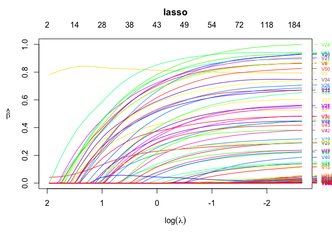

## Introduction to \`ordinis’

Install using the **devtools** package:

``` r
devtools::install_github("jaredhuling/ordinis")
```

or by cloning and building

## Example

``` r
library(ordinis)

# compute the full solution path, n > p
set.seed(123)
n <- 500
p <- 1000
m <- 50
b <- matrix(c(runif(m), rep(0, p - m)))
x <- matrix(rnorm(n * p, sd = 3), n, p)
y <- drop(x %*% b) + rnorm(n)

mod <- ordinis(x, y, 
               lower.limits = rep(0, p), # force all coefficients to be positive
               penalty.factor = c(0, 0, rep(1, p-2)), # don't penalize first two coefficients
               alpha = 0.5)  # use elastic net with alpha = 0.5

plot(mod)
```

<!-- -->

``` r
## show likelihood
logLik(mod)
```

    ## 'log Lik.' -1967.7214, -1966.1762, -1964.2736, -1962.5033, -1960.3369, -1955.8516, -1948.2720, -1938.8205, -1928.5541, -1916.8847, -1904.0076, -1888.8917, -1872.2290, -1853.9372, -1835.9337, -1818.3888, -1800.4209, -1782.9165, -1765.5641, -1745.4129, -1722.1892, -1696.7341, -1669.8390, -1641.5426, -1611.9442, -1581.6939, -1551.4815, -1520.6612, -1488.6982, -1457.0206, -1425.8839, -1394.5278, -1363.5028, -1331.1510, -1299.6138, -1269.8984, -1242.7093, -1216.8501, -1191.1585, -1162.5390, -1135.3961, -1109.8608, -1086.1417, -1064.1382, -1043.5081, -1019.0265,  -994.0337,  -969.6403,  -946.8524,  -924.9393,  -902.0886,  -880.6078,  -860.6727,  -840.6604,  -822.4399,  -805.7956,  -790.8334,  -777.6485,  -766.4901,  -756.5716,  -747.9103,  -740.5282,  -734.2969,  -729.0013,  -724.6141,  -720.8922,  -717.7438,  -714.6907,  -710.8176,  -706.5245,  -702.5694,  -698.7011,  -694.7904,  -690.9188,  -686.5191,  -681.8809,  -676.4401,  -671.4800,  -666.7939,  -662.1200,  -656.8514,  -650.4544,  -643.2409,  -635.4958,  -627.2270,  -617.2693,  -604.3401,  -591.1711,  -578.7512,  -567.4965,  -555.7354,  -544.3856,  -533.2053,  -521.5066,  -510.9836,  -497.0857,  -482.9402,  -468.2039,  -452.6913,  -436.8908 (df=  3  4  4  4  5  8 10 11 12 14 15 18 20 21 21 21 22 22 24 27 29 30 32 33 34 34 34 35 35 35 35 36 38 39 39 39 39 39 42 42 42 42 42 42 43 45 46 46 46 47 47 47 48 48 48 48 48 48 48 48 48 48 48 48 48 48 48 49 50 51 52 52 53 55 56 59 60 61 62 64 67 70 74 81 88 96100105106111117118125129128138138143146151)

``` r
## compute AIC
AIC(mod)
```

    ##   [1] 3941.443 3940.352 3936.547 3933.007 3930.674 3927.703 3916.544
    ##   [8] 3899.641 3881.108 3861.769 3838.015 3813.783 3784.458 3749.874
    ##  [15] 3713.867 3678.778 3644.842 3609.833 3579.128 3544.826 3502.378
    ##  [22] 3453.468 3403.678 3349.085 3291.888 3231.388 3170.963 3111.322
    ##  [29] 3047.396 2984.041 2921.768 2861.056 2803.006 2740.302 2677.228
    ##  [36] 2617.797 2563.419 2511.700 2466.317 2409.078 2354.792 2303.722
    ##  [43] 2256.283 2212.276 2173.016 2128.053 2080.067 2031.281 1985.705
    ##  [50] 1943.879 1898.177 1855.216 1817.345 1777.321 1740.880 1707.591
    ##  [57] 1677.667 1651.297 1628.980 1609.143 1591.821 1577.056 1564.594
    ##  [64] 1554.003 1545.228 1537.784 1531.488 1527.381 1521.635 1515.049
    ##  [71] 1509.139 1501.402 1495.581 1491.838 1485.038 1481.762 1472.880
    ##  [78] 1464.960 1457.588 1452.240 1447.703 1440.909 1434.482 1432.992
    ##  [85] 1430.454 1426.539 1408.680 1392.342 1369.502 1356.993 1345.471
    ##  [92] 1324.771 1316.411 1301.013 1277.967 1270.171 1241.880 1222.408
    ##  [99] 1197.383 1175.782

``` r
## BIC
BIC(mod)
```

    ##   [1] 3954.087 3957.211 3953.406 3949.865 3951.747 3961.420 3958.690
    ##   [8] 3946.002 3931.683 3920.774 3901.234 3889.646 3868.750 3838.381
    ##  [15] 3802.374 3767.284 3737.563 3702.554 3680.279 3658.620 3624.602
    ##  [22] 3579.907 3538.545 3488.167 3435.185 3374.684 3314.260 3258.834
    ##  [29] 3194.908 3131.553 3069.279 3012.782 2963.161 2904.672 2841.597
    ##  [36] 2782.167 2727.788 2676.070 2643.331 2586.092 2531.806 2480.735
    ##  [43] 2433.297 2389.290 2354.244 2317.710 2273.939 2225.153 2179.577
    ##  [50] 2141.965 2096.264 2053.302 2019.647 1979.622 1943.181 1909.892
    ##  [57] 1879.968 1853.598 1831.281 1811.444 1794.122 1779.358 1766.895
    ##  [64] 1756.304 1747.529 1740.086 1733.789 1733.897 1732.366 1729.994
    ##  [71] 1728.298 1720.562 1718.955 1723.641 1721.056 1730.424 1725.757
    ##  [78] 1722.051 1718.894 1721.975 1730.081 1735.931 1746.363 1774.375
    ##  [85] 1801.340 1831.141 1830.141 1834.876 1816.251 1824.815 1838.580
    ##  [92] 1822.095 1843.237 1844.698 1817.437 1851.787 1823.496 1825.097
    ##  [99] 1812.715 1812.187

## Performance

### Lasso

``` r
library(microbenchmark)
library(glmnet)

b <- matrix(c(runif(m, min = -1), rep(0, p - m)))
x <- matrix(rnorm(n * p, sd = 3), n, p)
y <- drop(x %*% b) + rnorm(n)

lambdas = glmnet(x, y)$lambda

microbenchmark(
    "glmnet[lasso]" = {resg <- glmnet(x, y, thresh = 1e-10,  # thresh must be very small 
                                      lambda = lambdas)},    # for comparable precision
    "cd[lasso]"     = {reso <- ordinis(x, y, lambda = lambdas, 
                                       tol = 1e-5)},
    times = 5
)
```

    ## Unit: milliseconds
    ##           expr      min       lq     mean   median       uq      max neval
    ##  glmnet[lasso] 158.0572 167.2059 212.4205 169.6786 230.9691 336.1919     5
    ##      cd[lasso] 444.0832 451.8748 501.6768 467.7850 515.2501 629.3910     5

``` r
# difference of results
max(abs(coef(resg) - reso$beta))
```

    ## [1] 0.3441506

``` r
microbenchmark(
    "glmnet[lasso]" = {resg <- glmnet(x, y, thresh = 1e-15,  # thresh must be very low for comparable precision
                                      lambda = lambdas)},
    "ordinis[lasso]"     = {reso <- ordinis(x, y, lambda = lambdas, 
                                            tol = 1e-5)},
    times = 5
)
```

    ## Unit: milliseconds
    ##            expr      min       lq     mean   median       uq      max
    ##   glmnet[lasso] 277.3993 278.3717 307.2595 279.7202 299.3477 401.4586
    ##  ordinis[lasso] 442.8283 447.4770 468.8273 455.5285 465.8206 532.4821
    ##  neval
    ##      5
    ##      5

``` r
# difference of results
max(abs(coef(resg) - reso$beta))
```

    ## [1] 0.3441507
